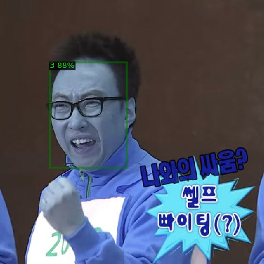

# Object Detection Based Visual Sentiment Classification

This repository contains code that utilizes the Faster R-CNN model to perform both localization and classification on given images.



## Requirements & Setup

- Operating System: Linux or macOS
- Python Version: Python ≥ 3.7
- PyTorch: PyTorch ≥ 1.8 and a matching torchvision. Ensure compatible installation from [pytorch.org](https://pytorch.org)
- OpenCV (optional): Needed for demo and visualization purposes

## Build Detectron2 from Source

- Required Tools: gcc & g++ ≥ 5.4. ninja is optional but recommended for a faster build.
- Installation Command:
  ```bash
  python -m pip install 'git+https://github.com/facebookresearch/detectron2.git'
  # Use --user if you don't have permission
  ```

## How to Run
### Datasets

[한국인 감정인식을 위한 복합 영상](https://aihub.or.kr/aihubdata/data/view.do?currMenu=115&topMenu=100&aihubDataSe=realm&dataSetSn=82)

After downloading, save in ./dataset directory.
Running Inference

### Running Inference
```
python inference.py --config-path ./configs/faster_rcnn_R_50_FPN_1x.yaml
```
